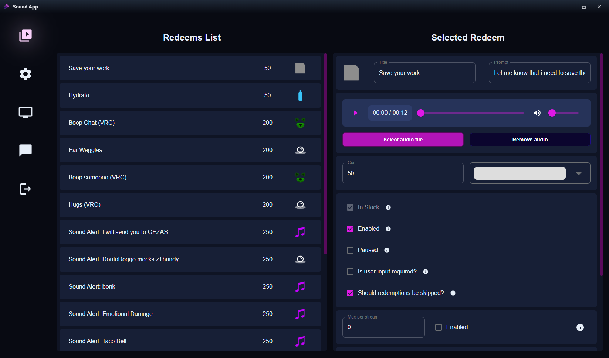
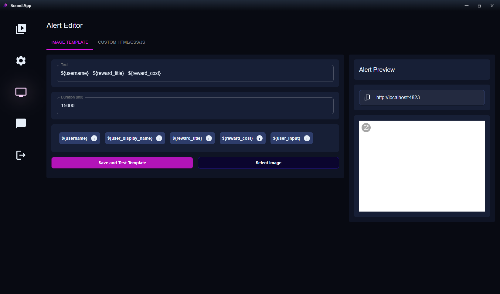
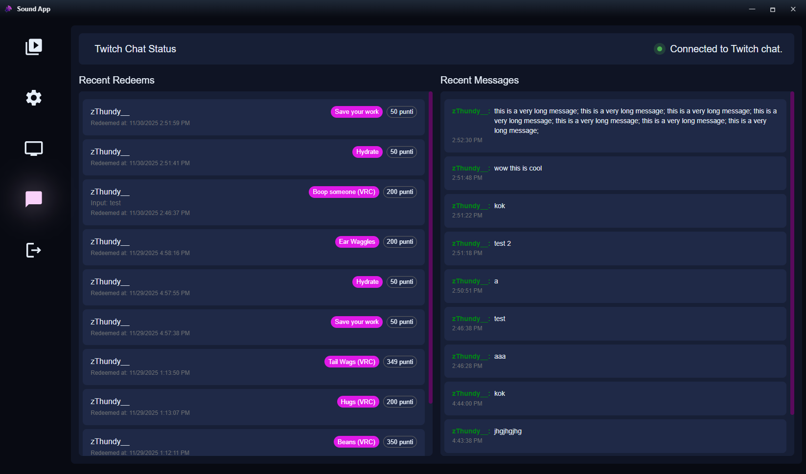

#  SoundApp

[](https://github.com/zThundy/SoundApp/actions/workflows/build.yml)
[](https://github.com/zThundy/SoundApp/releases)

### Tests

[](https://github.com/zThundy/SoundApp/actions/workflows/update-dependencies.yml)
[](https://github.com/zThundy/SoundApp/actions/workflows/test-app-launch.yml)
[](https://github.com/zThundy/SoundApp/actions/workflows/test-login.yml)

An Electron application to manage alerts (and sounds) for Twitch streams.



## Alerts Page for OBS

When the application starts, a small local web server is automatically launched that serves a blank page designed to be captured by OBS.

Default local URL:

```
http://localhost:4823/
```

### How to use it in OBS
1. Open OBS.
2. Add a new source: Browser Source.
3. Enter the URL `http://localhost:4823/`.
4. Set page dimension to either 1920x1080 or 1280x720 (not necessary but this will make the alert more visible).
5. The page is initially blank. Alerts will appear in the center when sent from the app.

### Issues / ideas
For issues or ideas: open an issue in the repository.

## Creating Alerts from the Frontend

From the menu (alerts page) you can create two types of alerts:




1. Custom HTML/CSS/JS
	- Work in progress

2. Image Template
	- Select an image file.
	- Set the text (caption) displayed below.
	- Duration (ms) indicates how long it remains visible (default 6000).
	- Press "Send Image Template" to send.

### Todo and FAQ
TODO:
  - Add logic for new button
  - Add logic for edit of redeem to post to Twitch
  - Work on async encription for credentials
  - Issue where on first launch images and some functionalities don't work until the app is restarted
	- Work on automatic updater

FAQ:
	- None for now :)

### Security Notes
1. The Twitch token is **locally stored and encrypted** in the elctron storage using the [Safe Storage API](https://www.electronjs.org/docs/latest/api/safe-storage)
2. Comunication with Twitch is done by using the HTTPS protocol and WSS comunication.
3. The web server for the alert is only accessible as a local connection (either with localhost or 192.168.1.1).