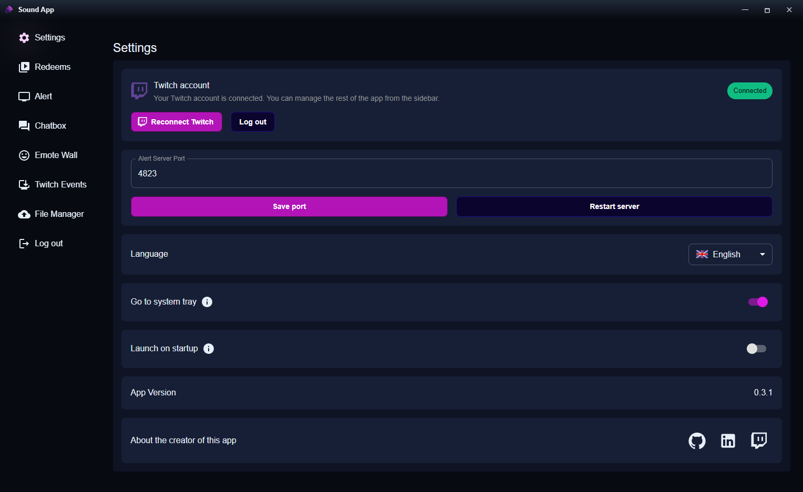
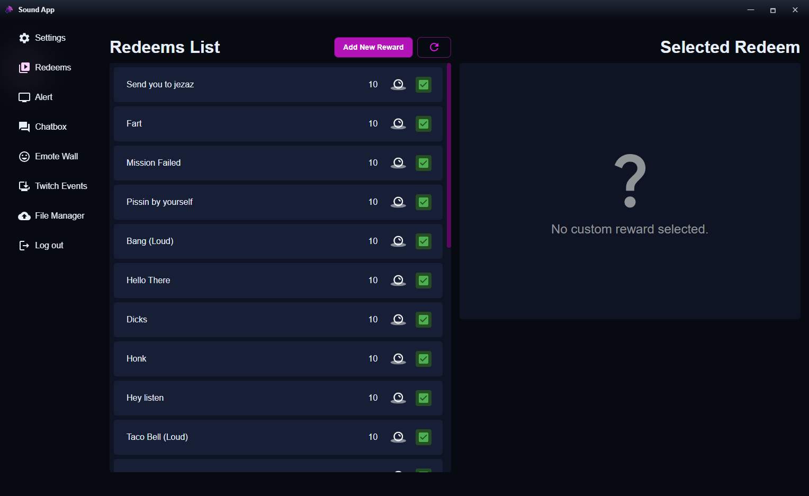
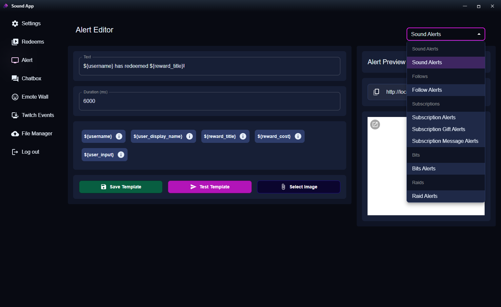
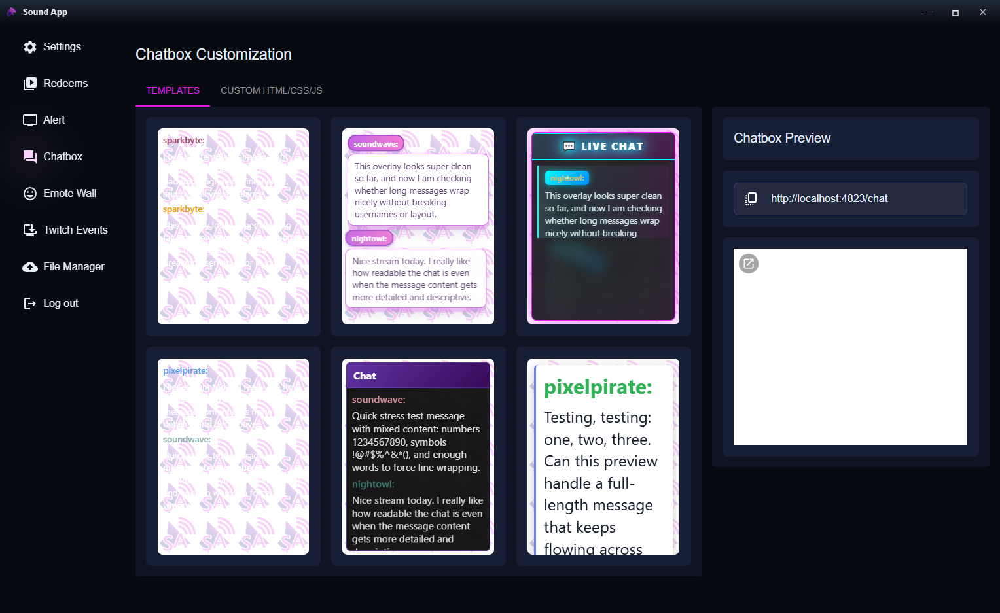
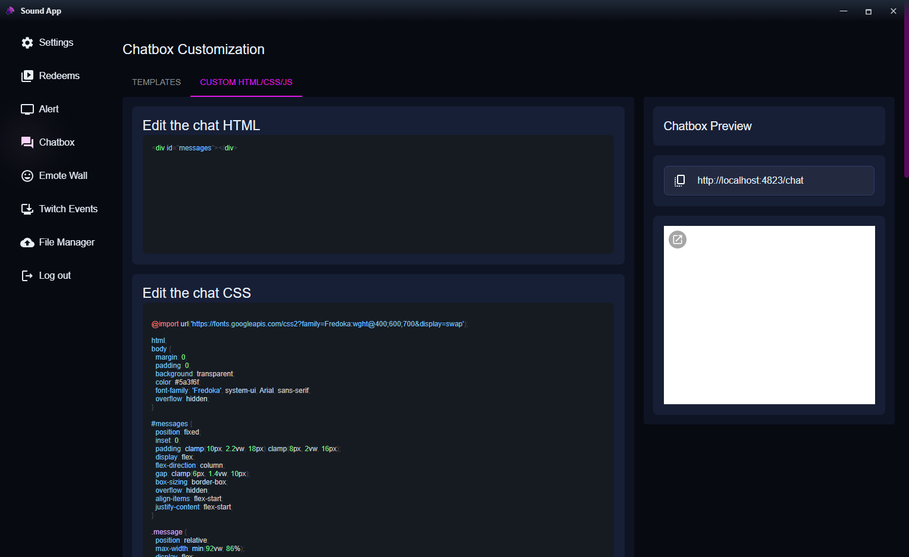
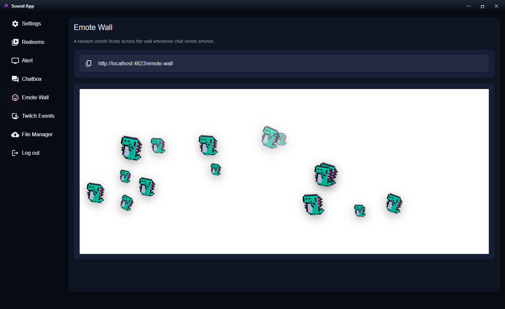

#  SoundApp

[](https://github.com/zThundy/SoundApp/actions/workflows/build.yml)
[](https://github.com/zThundy/SoundApp/releases)
<br>
<br>
Do you care about your privacy?<br>
Do you care about your Twitch account?<br>
Are you aware of the fact that most of the services that offer overlays, chat, alerts, etc. request more permission than they need just to have full access to your Twitch accounts through API calls?
<br>
WELL THEN. This app is for you!<br>
With this application you will be able to have all the tools to make your stream unique and engaging to viewers, having everything HOSTED LOCALLY!
<br>
<br>
[](https://github.com/zThundy/SoundApp/releases/latest)
<br>
<br>


## Alerts Page for OBS

When the application starts, a small local web server is automatically launched that serves a blank page designed to be captured by OBS.

Default local URL:

```
http://localhost:4823/
```

Different tools have been designed to be used in the app, and these are:
- Twitch events Alerts
	+ Sound alerts for Twitch points redeems
	+ Followers
	+ Subscription
	+ Resubscriptions
	+ Gifted subscriptions
	+ Gifted Bits
	+ Raids
- Chatbox
	+ Default templates (being open source you can submit PRs to update them)
	+ Custom HTML styling
- Emote wall

## How to use it in OBS
1. Open OBS.
2. Add a new source: Browser Source.
3. Enter the URL `http://localhost:4823/`.
4. Set page dimension to either 1920x1080 or 1280x720 (not necessary but this will make the alert more visible).
5. The page is initially blank. Alerts will appear in the center when sent from the app.

## Gallery

### Redeems page



### Alerts configuration page



### Chatbox templates and HTML customization




### Emote Wall



## Tests

[](https://github.com/zThundy/SoundApp/actions/workflows/update-dependencies.yml)

## Issues / ideas
For issues or ideas: open an issue in the repository.
If you have any ideas and know how to code, feel free to submit a PR

## Security Notes
1. The Twitch token is **locally stored and encrypted** in the elctron storage using the [Safe Storage API](https://www.electronjs.org/docs/latest/api/safe-storage)
2. Comunication with Twitch is done by using the HTTPS protocol and WSS comunication.
3. The web server for the alert is only accessible as a local connection (either with localhost or 192.168.1.1).